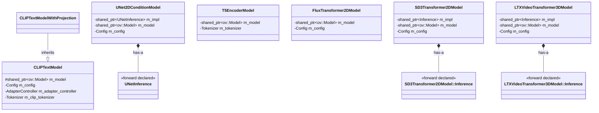

# Pipeline & Model Classes Relationship Diagram

All classes whose names contain "pipeline" or "model" (case-insensitive) under `src/cpp/include/openvino/genai`.

## Pipeline Class List

| # | Class | Header File |
|---|-------|-------------|
| 1 | `LLMPipeline` | `llm_pipeline.hpp` |
| 2 | `ContinuousBatchingPipeline` | `continuous_batching_pipeline.hpp` |
| 3 | `WhisperPipeline` | `whisper_pipeline.hpp` |
| 4 | `VLMPipeline` | `visual_language/pipeline.hpp` |
| 5 | `Text2ImagePipeline` | `image_generation/text2image_pipeline.hpp` |
| 6 | `Image2ImagePipeline` | `image_generation/image2image_pipeline.hpp` |
| 7 | `InpaintingPipeline` | `image_generation/inpainting_pipeline.hpp` |
| 8 | `Text2SpeechPipeline` | `speech_generation/text2speech_pipeline.hpp` |
| 9 | `Text2VideoPipeline` | `video_generation/text2video_pipeline.hpp` |
| 10 | `TextEmbeddingPipeline` | `rag/text_embedding_pipeline.hpp` |
| 11 | `TextRerankPipeline` | `rag/text_rerank_pipeline.hpp` |

> None of the public pipeline classes inherit from each other. All use the **pimpl** (pointer-to-implementation) pattern with forward-declared impl classes.

## Relationship Diagram (Mermaid)

```mermaid
classDiagram
    direction TB

    %% ──────────────── LLM ────────────────
    class LLMPipeline {
        -unique_ptr~LLMPipelineImplBase~ m_pimpl
    }
    class LLMPipelineImplBase {
        <<forward declared>>
    }
    LLMPipeline *-- LLMPipelineImplBase : has-a

    %% ──────────────── Continuous Batching ────────────────
    class ContinuousBatchingPipeline {
        -shared_ptr~IContinuousBatchingPipeline~ m_impl
    }
    class IContinuousBatchingPipeline {
        <<forward declared>>
    }
    ContinuousBatchingPipeline *-- IContinuousBatchingPipeline : has-a

    %% ──────────────── Whisper ────────────────
    class WhisperPipeline {
        -unique_ptr~WhisperPipelineImplBase~ m_impl
    }
    class WhisperPipelineImplBase {
        <<forward declared>>
    }
    WhisperPipeline *-- WhisperPipelineImplBase : has-a

    %% ──────────────── VLM ────────────────
    class VLMPipeline {
        -unique_ptr~VLMPipelineBase~ m_pimpl
    }
    class VLMPipelineBase {
        <<forward declared>>
    }
    VLMPipeline *-- VLMPipelineBase : has-a

    %% ──────────────── Image Generation ────────────────
    class DiffusionPipeline {
        <<forward declared>>
    }
    class Text2ImagePipeline {
        -shared_ptr~DiffusionPipeline~ m_impl
    }
    class Image2ImagePipeline {
        -shared_ptr~DiffusionPipeline~ m_impl
    }
    class InpaintingPipeline {
        -shared_ptr~DiffusionPipeline~ m_impl
    }
    Text2ImagePipeline *-- DiffusionPipeline : has-a
    Image2ImagePipeline *-- DiffusionPipeline : has-a
    InpaintingPipeline *-- DiffusionPipeline : has-a

    Text2ImagePipeline <.. Image2ImagePipeline : constructs from
    Text2ImagePipeline <.. InpaintingPipeline : constructs from
    Image2ImagePipeline <.. InpaintingPipeline : constructs from

    %% ──────────────── Speech ────────────────
    class Text2SpeechPipeline {
        -shared_ptr~Text2SpeechPipelineImpl~ m_impl
    }
    class Text2SpeechPipelineImpl {
        <<forward declared>>
    }
    Text2SpeechPipeline *-- Text2SpeechPipelineImpl : has-a

    %% ──────────────── Video ────────────────
    class Text2VideoPipeline {
        -unique_ptr~LTXPipeline~ m_impl
    }
    class LTXPipeline {
        <<forward declared>>
    }
    Text2VideoPipeline *-- LTXPipeline : has-a

    %% ──────────────── RAG ────────────────
    class TextEmbeddingPipeline {
        -unique_ptr~TextEmbeddingPipelineImpl~ m_impl
    }
    class TextEmbeddingPipelineImpl {
        <<forward declared>>
    }
    TextEmbeddingPipeline *-- TextEmbeddingPipelineImpl : has-a

    class TextRerankPipeline {
        -unique_ptr~TextRerankPipelineImpl~ m_impl
    }
    class TextRerankPipelineImpl {
        <<forward declared>>
    }
    TextRerankPipeline *-- TextRerankPipelineImpl : has-a
```

## Relationship Summary

### Has-a (Composition via pimpl)

| Public Pipeline Class | Impl Member | Smart Pointer |
|---|---|---|
| `LLMPipeline` | `LLMPipelineImplBase` | `std::unique_ptr` |
| `ContinuousBatchingPipeline` | `IContinuousBatchingPipeline` | `std::shared_ptr` |
| `WhisperPipeline` | `WhisperPipelineImplBase` | `std::unique_ptr` |
| `VLMPipeline` | `VLMPipelineBase` | `std::unique_ptr` |
| `Text2ImagePipeline` | `DiffusionPipeline` | `std::shared_ptr` |
| `Image2ImagePipeline` | `DiffusionPipeline` | `std::shared_ptr` |
| `InpaintingPipeline` | `DiffusionPipeline` | `std::shared_ptr` |
| `Text2SpeechPipeline` | `Text2SpeechPipelineImpl` | `std::shared_ptr` |
| `Text2VideoPipeline` | `LTXPipeline` | `std::unique_ptr` |
| `TextEmbeddingPipeline` | `TextEmbeddingPipelineImpl` | `std::unique_ptr` |
| `TextRerankPipeline` | `TextRerankPipelineImpl` | `std::unique_ptr` |

### Cross-construction (Image Generation Family)

`Text2ImagePipeline`, `Image2ImagePipeline`, and `InpaintingPipeline` share the same `DiffusionPipeline` impl and can be constructed from each other:

- `Text2ImagePipeline(const Image2ImagePipeline&)`
- `Text2ImagePipeline(const InpaintingPipeline&)`
- `Image2ImagePipeline(const InpaintingPipeline&)`
- `InpaintingPipeline(const Image2ImagePipeline&)`

### Inheritance

No public pipeline classes inherit from one another. All impl base classes (`LLMPipelineImplBase`, `IContinuousBatchingPipeline`, `WhisperPipelineImplBase`, `VLMPipelineBase`, `DiffusionPipeline`) are forward-declared in the public headers and defined only in internal implementation files.

---

## Model Class List

| # | Class | Header File |
|---|-------|-------------|
| 1 | `CLIPTextModel` | `image_generation/clip_text_model.hpp` |
| 2 | `CLIPTextModelWithProjection` | `image_generation/clip_text_model_with_projection.hpp` |
| 3 | `UNet2DConditionModel` | `image_generation/unet2d_condition_model.hpp` |
| 4 | `T5EncoderModel` | `image_generation/t5_encoder_model.hpp` |
| 5 | `FluxTransformer2DModel` | `image_generation/flux_transformer_2d_model.hpp` |
| 6 | `SD3Transformer2DModel` | `image_generation/sd3_transformer_2d_model.hpp` |
| 7 | `LTXVideoTransformer3DModel` | `video_generation/ltx_video_transformer_3d_model.hpp` |

> `CLIPTextModelWithProjection` inherits from `CLIPTextModel`. All model classes hold a `std::shared_ptr<ov::Model>` member.

## Model Relationship Diagram (Mermaid)

## Model Relationship Summary

### Inheritance

| Derived Class | Base Class |
|---|---|
| `CLIPTextModelWithProjection` | `CLIPTextModel` |

### Has-a (Composition)

| Model Class | Impl Member | Smart Pointer |
|---|---|---|
| `CLIPTextModel` | `ov::Model` | `std::shared_ptr` |
| `CLIPTextModelWithProjection` | *(inherited from CLIPTextModel)* | `std::shared_ptr` |
| `UNet2DConditionModel` | `UNetInference` | `std::shared_ptr` |
| `UNet2DConditionModel` | `ov::Model` | `std::shared_ptr` |
| `T5EncoderModel` | `ov::Model` | `std::shared_ptr` |
| `FluxTransformer2DModel` | `ov::Model` | `std::shared_ptr` |
| `SD3Transformer2DModel` | `Inference` | `std::shared_ptr` |
| `SD3Transformer2DModel` | `ov::Model` | `std::shared_ptr` |
| `LTXVideoTransformer3DModel` | `Inference` | `std::shared_ptr` |
| `LTXVideoTransformer3DModel` | `ov::Model` | `std::shared_ptr` |
